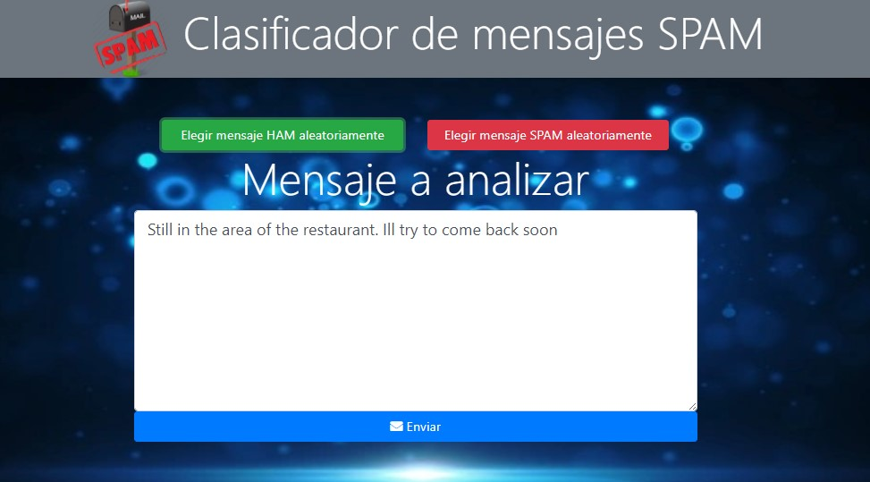
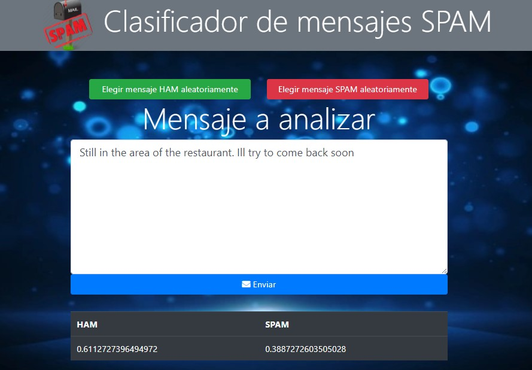

# Clasificador SPAM/HAM

## 1. Introducción

Esta es la implementación del algoritmo Bayes Ingenuo para determinar si un mensaje dado puede ser calificado como **spam**, o no (**ham**).

## 2. Sobre la técnica utilizada

La técnica Bayes Ingenuo es un tipo de red bayesiana, utilizado normalmente en problemas de clasificación, en la que se asume que todas las variables consideradas en la clasificación son independientes. En nuestro caso, estas variables son las probabilidades de que una palabra se encuentre en un mensaje spam; en otras palabras, para esta clasificación asumimos que **la aparición de una palabra en un mensaje dado, no altera la probabilidad de que aparezca una segunda palabra**.

Para mayor información, consultar [aquí](https://www.notion.so/Implementaci-n-de-un-Clasificador-de-Spam-utilizando-Bayes-Ingenuo-9563395a57ab4ddb9864bdf54cb10a67) el informe preparado para la presentación de esta implementación en mi universidad.

## 3. Sobre el Dataset

- Utilizamos un conjunto de más de 5000 mensajes en idioma inglés, el cual se puede obtener desde [esta página](https://archive.ics.uci.edu/ml/datasets/sms+spam+collection) de manera gratuita. 
  
- Cada mensaje dentro del dataset está clasificado con una etiqueta, la cual indica si el mensaje es spam o ham.

## 4.- Sobre la metodología

- A partir del dataset, escogimos un 75% para realizar el entrenamiento del sistema, y el otro 25% fue utilizado para realizar las pruebas.

- Posteriormente, realizamos las siguientes modificaciones en el dataset:
  
  - Las letras fueron convertidas a minúsculas.
  
  - Todo número incluído en un mensaje fue reemplazado por la palabra **number**.
  
  - Las URLs fueron reemplazadas por la palabra **httpaddr**.
  
  - Consideraremos palabras que comúnmente se usan en los mensajes en el idioma inglés para evitar tomarlas en cuenta al momento de crear el diccionario. Estas fueron obtenidas desde este [enlace]("https://www.ranks.nl/stopwords\").
  
  - Los símbolos como **, . ; @ # ? ! & \\$ : _** fueron retirados de los mensajes para poder trabajar mayoritariamente con las palabras.
  
- Luego, para cada palabra encontrada en todo el conjunto de datos, determinamos cuál era la probabilidad de que aparezca en un mensaje spam.

- Finalmente, determinamos cuál es la probabilidad de que un mensaje sea spam, conteniendo un conjunto determinado de palabras.

## 5. Tecnologías

- Utilizamos el lenguaje Python para la implementación del algoritmo de clasificacion. Asimismo, utilizamos las librerías numpy y sklearn para los cálculos.
  
- Utilizamos el framework DJango para realizar una pequeña página web y mostrar los resultados obtenidos con la investigación.

## 6. Resultados

Producto de las pruebas realizadas con el conjunto de datos definido para este fin, logramos que el sistema alcance un 98% de aciertos en la clasificación de los mensajes.

## 6.- En producción

Puedes encontrar una demo de la aplicación [aquí](https://bg-spam-classifier.herokuapp.com).
Podrás escoger un mensaje spam o ham aleatoriamente y encontrar la probabilidad, determinada por el sistema, de que dicho mensaje sea spam.

**Contacto:**

 